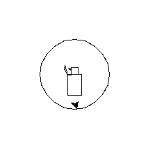

test text
===

- a
- b
- c
- x
+ d
* e

> test 
> - ***tohohle*__
> - *bloku*
> - __neco__

***

1. a
3. c

`some sort of code`
`` double code `code` code ``

ne
-------------------

Search engine [<em>Duck Duck Go</em>](https://duckduckgo.com "The best search engine for privacy")
<https://google.com>

<em>chacha</em>
\-

1. a
2. b
    3. x
4. c
        14. d
156. e
6. d

###### xk h6

|hlavicka|dva|
|--------|---|
|*nejaky*|bunky|
|ktery|nejsou|super|